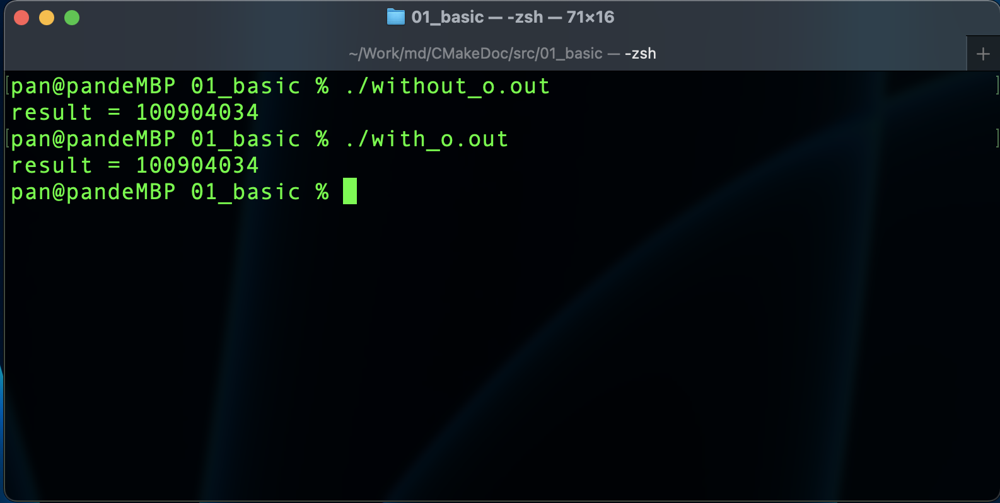
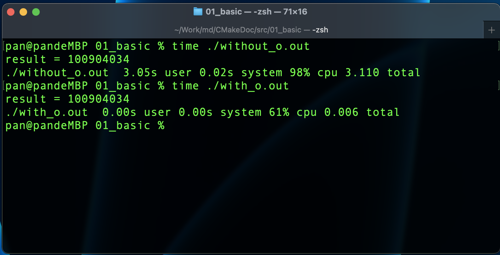

# Linux中编译C++代码的g++工具，以及g++的常用操作指令

> 这是一篇技术文章，如果你想继续阅读，并希望从中有所收获，你现在应当具备以下技能：

- **C++ 编程语言基础**
- **Linux 操作系统基础**

本文目录

```text
1. GCC概述
2. g++编译过程
3. g++重要编译参数
   3.1. 编译带调试信息的可执行文件
   3.2. 优化源代码
   3.3. 指定库文件
   3.4. -I 指定头文件搜索目录
   3.5. -Wall 打印警告信息
   3.6. -w 关闭警告信息
   3.7. 使用-std 设置编译标准
   3.8. -o(小写) 指定输出文件名
4. 总结
```

## 1. GCC概述

> GCC（GNU Compiler Collection，GNU编译器套件）是由GNU开发的编程语言译器。而GCC下面有两个比较常用的工具就是gcc(GUN C Compiler)和g++(GUN C++ Compiler)，即C语言编译器和C++编译器。人们通常用gcc编译纯C代码，用g++编译C++代码。实际上可以用直接用g++编译C或者C++代码，本文我们学习怎样使用g++。
>

- GCC 编译器支持编译 Go、Object-C、Object-C ++、Fortran、Ada、BRIG（HSAIL）等程序；
- Linux 开发 C/C++ 一定要熟悉 GCC；
- VSCode 是通过调用 GCC 编译器来实现 C/C++的编译工作的。

开始之前，先安装`g++`编译工具，如下命令

```shell
sudo apt install -y g++
```

## 2. g++编译过程

使用 `g++` 编译C++源代码的时候，我们可使用以下命令 即可完成编译C++源代码文件，并且直接产生可执行的二进制文件

```shell
# 编译test.cpp 文件，在 Linux 下，默认产生名为 a.out 的二进制可执行文件
g++ test.cpp
```

实际上，上面的一步编译指令包含了以下几个过程

**第一步**：预处理 Pre-processing，生成.i 文件

```shell
# -E 选项指示编译器仅对输入文件进行预编译
g++ -E test.cpp -o testr.i
```

**第二步**：编译-Compiling，生成.s 文件

```shell
# -S 编译选项告诉 g++ 在为 c++ 代码产生了汇编语言文件后停止编译
# g++ 产生的汇编语言文件的缺省扩展名是 .s
g++ -S test.i -o test.s
```

**第三步**：汇编-Assembing，生成.o 文件

```shell
# -c 选项告诉 g++ 仅把源代码编译为机器语言的目标代码
# 缺省时 g++ 建立的目标代码文件有一个 .o 的扩展名
g++ -c test.s -o test.o
```

**第四步**：链接-Lingking，生成 bin 二进制文件

```shell
# -o 编译选项来为将产生的可执行文件指定文件名，如果不使用-o参数，在Linux下默认输出名为 a.out 的可执行文件
g++ test.o -o test
```

## 3. g++重要编译参数

### 3.1. 编译带调试信息的可执行文件

`-g` 选项告诉GCC产生能被 GNU调试器(DGB) 使用的调试信息，以调试程序

```shell
# 产生带调试信息的可执行文件test
g++ -g test.cpp -o test
```

### 3.2. 优化源代码

所谓优化，是指如省略代码中从来未使用过的变量、直接常量表达式用结果替代等操作，这些操作会缩减目标文件所含的代码，提高最终生成的可执行文件的运行效率。

> `O` 参数告诉 g++ 对源代码进行基本优化。这些优化在大多数情况下都使程序执行得更快，常用优化级别如下：

`-O`: 同时减少代码的长度和执行时间，其效果等价于 `-O1`

`-O0`: 表示不做优化

`-O1`: 表示默认优化

`-O2`: 告诉 g++ 产生尽可能小和尽可能快的代码。除了完成`-O1` 的优化之外，还进行一些额外的调整工作，如指令调整等

`-O3`: 包括循环展开和其他一些与处理性相关的优化工作，选项将使编译的速度比 `-O` 慢，但通常产生的代码执行速度会更快。

```shell
# 使用 -O2 优化源代码，并输出可执行文件。
g++ -O2 test.cpp
```

#### 3.2.1 源代码优化示例

创建一个效率低下的代码文件 `src/01_basic/inefficency.cpp` ，添加以下C++源代码

```cpp
#include <iostream>
using namespace std;

int main(int argc, char const *argv[])
{
    unsigned long int counter;
    unsigned long int result;
    unsigned long int temp;
    unsigned long int five;
    
    for (counter = 0; counter < 2009 * 2009 * 100 / 4 + 2010 ; counter += (10-6)/4)
    {
        temp = counter/1979;
        for (int i = 0; i < 20; i++)
        {
            // 每次循环都会进行一次无用的 复杂的运算
            five = 200 * 200 / 8000;
            result = counter;
        }
    }
    
    cout << "result = " << result << endl;
    
    return 0;
}
```

先使用直接编译的方式生成`without_o.out`可执行文件，如下命令

```shell
# 代码无优化
g++ inefficency.cpp -o without_o.out
```

接下来我们再使用优化后的编译方式，生成`with_o.out`可执行文件，如下命令

```shell
# 使用-O2级别的代码优化
g++ inefficency.cpp -O2 -o with_o.out
```

后执行两种方式编译生成的可执行文件，如下图



可以看到计算的结果是一样的，但是我们可以通过等待时间知道 没有编译优化的 `without_o.out` 执行时间明显大于 `with_o.out`。我们可以使用 `time` 命令计算执行程序所需的时间，可以看到明显的时间区别，如下图



> 总结：加上 -O 优化参数后（我们一般使用 -O2），编译器会帮我们优化低效率的代码。从而提高最终程序的执行效率。

### 3.3. 指定库文件

> 在 g++ 工具中， `-l` 或者 `-L` 指定库文件，|(大写i) 指定库文件路径

-l 参数（小写L）就是用来指定程序要链接的库，-l 参数紧接着就是库名，在`/lib`、`/usr/lib`、`/usr/local/lib`里的库直接调用 -l 参数就能链接，这三个库目录我们在下文中叫做**系统库目录**

```shell
# 链接 glog库 编译
g++ -lglog test.cpp
```

如果库文件没有放在**系统库目录**中，需要使用-L 参数（大写l）指定库文件所在目录，-L 参数跟着的是库文件所在的目录名

```shell
# 链接 mytest库。libmytest.so 在 ~/lib目录下
g++ -L~/lib -lmytest test.cpp
```

### 3.4. `-I` 指定头文件搜索目录

`/usr/include` 一般不用指定，gcc 知道去那里找，但是如果头文件不在 `/usr/include` 里我们就要用 `-I` 参数指定了，比如头文件放在 `/myinclude`目录里，那编译命令行就要加上 `-I/myinclude` 参数，如果不加你会得到一个 `xxx.h: No such file or directory` 的错误。`-I` 参数可以使用相对路径，也可以使用绝对路径。

```shell
# 编译代码时，指定当前目录下的myinclude目录作为头文件目录
g++ -I/myinclde test.cpp
```

### 3.5. `-Wall` 打印警告信息

```shell
打印出gcc提供的警告信息
g++ -Wall test.cpp
```

### 3.6. `-w` 关闭警告信息

在使用高版本的C++标准进行编译的时候，代码写的不规范的时候，比如定义变量但是不使用，g++将会提示对应的警告信息。但可以使用`-w`关闭这些警告

```shell
# 关闭所有警告信息
g++ -w test.cpp
```

### 3.7. 使用`-std`设置编译标准

```shell
# 使用 c++11 标准编译 test.cpp
g++ -std=c++11 test.cpp
```

### 3.8. `-o`(小写) 指定输出文件名

```shell
# 指定即将产生的文件名为 test
g++ test.cpp -o test
```

### 3.9. `-D` 定义宏

为了演示宏的作用，创建源码文件 `gcc_02_test/test.cpp` ，并添加以下C++源代码

```cpp
#include <stdio.h>

int main()
{
    // 根据是否存在 DEBUG 进行逻辑处理
    #ifdef DEBUG
        printf("DEBUG LOG\n");
    #endif
        printf("in\n");
    return 0;
}
```

使用 `g++ -DDEBUG test.cpp` 编译的同时定义`DEBUG`宏，执行编译后的可执行文件可以看到 "DEBUG LOG" 被输出。原因是我们使用`-DDEBUG` 参数定义 `DEBUG` 宏，在执行程序的时候，程序检测到了 `DEBUG` 宏的存在，并执行了对应的逻辑。

## 4. 总结

在本节课，我们掌握了以下知识：

- GCC 的概念：GNU编译套件
- g++ 的编译过程
- g++ 的编译的常用参数
