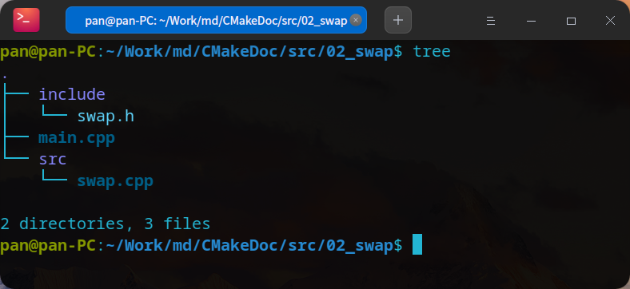
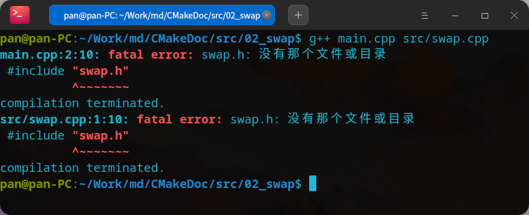
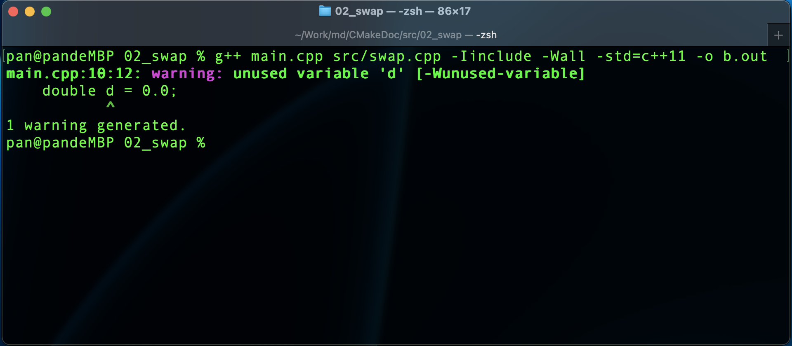

# Linux下C++命令行编译示例

> 此文档是在Linux下C/C++开发的g++编译示例，如果继续阅读此文，并希望有所收获，你应当具备以下技能

- C++编程语言基础
- Linux系统操作基础

文章目录

```text
1. 准备源代码
2. 编译实战
   2.1. 引入目录进行编译
   2.2. 使用-Wall、-std 参数进行编译
   2.1.3. 生成库文件
       链接静态库生成可执行文件
       链接动态库生成可执行文件
       静态库和动态库生成可执行文件的区别
```

这是这个系列的第2篇文章，你可以通过以下链接阅读第一篇

[1. Linux中编译C++代码的g++工具，以及g++的常用操作指令](./01-g++.md)

## 1. 准备源代码

在一个工作目录中创建以下代码文件，目录结构如下图



代码内容如下：

`swap.h`文件，这个源码文件中定义了C++头部信息

```cpp
#include <iostream>
using namespace std;
```

`swap.cpp`文件，这个文件中定义了我们将在主函数中调用的C++代码

```cpp
#include "swap.h"

void swap(int &a, int &b)
{
    int temp;
    temp = a;
    a = b;
    b = temp;
}
```

`main.cpp`文件，这是主函数文件，函数调用的入口

```cpp
#include <iostream>
#include "swap.h"
using namespace std;

int main(int argc, char const *argv[])
{
    int val1 = 10;
    int val2 = 20;

    cout << " Before swap:" << endl;
    cout << " val1:" << val1 << endl;
    cout << " val2:" << val2 << endl;

    swap(val1, val2);

    cout << " After swap:" << endl;
    cout << " val1:" << val1 << endl;
    cout << " val2:" << val2 << endl;

    return 0;
}
```

## 2. 编译实战

### 2.1. 引入目录进行编译

直接编译

```shell
g++ main.cpp src/swap.cpp
```

此时会看到如下图的错误



这是因为 g++ 找不到`include`目录下的`swap.h` 文件，所以我们需要使用`-I`参数将`include`目录包含进来，如下命令

```shell
g++ main.cpp src/swap.cpp -Iinclude
```

这时候代码就可以顺便通过编译了。

### 2.2. 使用-Wall、-std 参数进行编译

`-Wall` 代表程序编译过程中输出警告信息，`-std`代表使用特定的 c++标准 进行编译，如下命令

```SHELL
# 使用c++11标准进行编译，并且使用-Wall参数
g++ main.cpp src/swap.cpp -Iinclude -Wall -std=c++11 -o a.out
```

此时我们看到，还是能正常编译，也没有输出警告，我们也可以正常执行`a.out`。因为我们的代码是符合`c++11`标准的，为了演示一个警告，我们在`main.cpp`中加一行代码。如下

```cpp
#include <iostream>
#include "swap.h"
using namespace std;

int main(int argc, char const *argv[])
{
    int val1 = 10;
    int val2 = 20;
    // 定义一个变量，但是不使用
    double d = 0.0;

    cout << " Before swap:" << endl;
    cout << " val1:" << val1 << endl;
    cout << " val2:" << val2 << endl;

    swap(val1, val2);

    cout << " After swap:" << endl;
    cout << " val1:" << val1 << endl;
    cout << " val2:" << val2 << endl;

    return 0;
}
```

把输出文件改为`b.out`，再次执行编译，如下命令

```SHELL
g++ main.cpp src/swap.cpp -Iinclude -Wall -std=c++11 -o b.out
```

此时出现如下图警告



因为定义一个变量不使用，是不符合`c++11`的标准的，但不是错误，`b.out`也能正常执行。

### 2.3. 生成库文件

我们先删除在 2 中会进行警告的代码

#### 2.3.1. 链接静态库生成可执行文件

```shell
# 先进入src目录
cd  src
# 汇编生成swap.o 文件
g++ swap.cpp -c -I../include
# 生成静态库libSwap.o
ar rs libswap.a swap.o
# 回到代码根目录，调用静态链接库生成可执行文件
g++ main.cpp -lswap -Lsrc -Iinclude -o static_main
```

#### 2.3.2. 链接动态库生成可执行文件

```shell
# 进入src目录
cd  src
# 生成动态链库文件libswap.so
g++ swap.cpp -I../include -fPIC -shared -o libswap.so
# 上面的指令等价于下面两条指令
# gcc swap -I../include -c -fPIC
# gcc -shared -o libswap.so swap.o

# 回到上级目录
cd ..
# 链接生成可执行文件 dyna_main
g++ main.cpp -Iinclude -lswap -Lsrc -o dyna_main
```

#### 2.3.3. 静态库和动态库生成可执行文件的区别

- 静态库在打包生成二进制文件的时候，直接将静态库包含进来
- 动态库则在打包时不打包库文件，而在运行时再把动态库文件引进来

所以我们运行的时候，静态库文件打包的可执行文件可以直接运行。而用动态库编译生成的可执行文件，直接运行会报错，是因为动态链接文件在我们的代码目录，并不在系统的库搜索目录。如果要运行动态链接库打包生成的可执行文件，我们需要手动指定程序运行依赖的库目录。

运行可执行文件命令如下：

运行静态打包的可执行文件

```shell
# 运行静态打包的可执行文件
./static_main
```

运行动态链接库打包生成的可执行文件

```shell
# 运行动态打包的可执行文件，需要设置 LD_LIBRARY_PATH 变量，变量值是动态链接文件所在目录
LD_LIBRARY_PATH=src ./dyna_main
```
