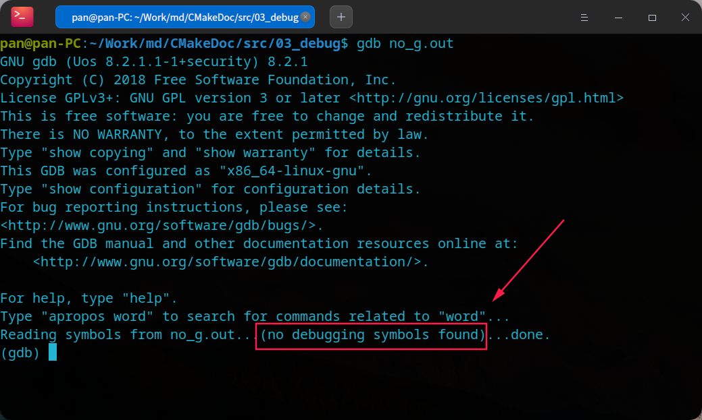
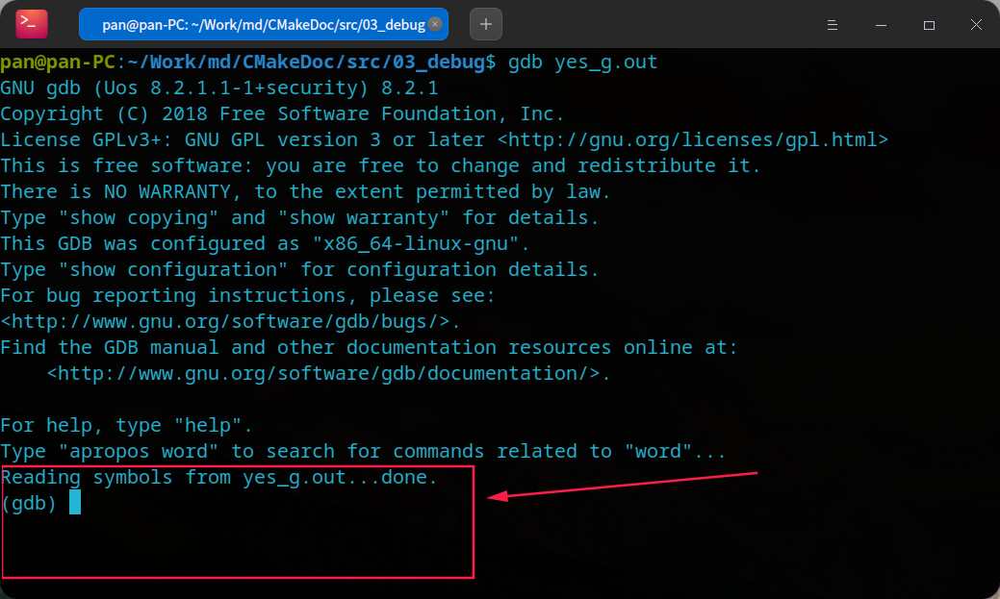

# Linux下C++命令行调试实战

## 1. 准备代码

创建一个C++源代码文件 `src/03_debug/sum.cpp`，添加以下代码

```cpp
#include <iostream>
using namespace std;

int main(int argc, char const *argv[])
{
	int N = 100;
	int sum = 0;
	int i = 1;

	while(i <= N){
		sum = sum + i;
		i = i + 1;
	}

	cout << "sum = " << sum <<endl;
	cout << "The program is over " <<endl;

	return 0;
}
```

## 2. 进入调试模式

在进入调试模式之前，先编译源代码，如果过程。

普通编译方式
```shell
g++ sum.cpp -o no_g.out
```

编译出用于调试的可执行文件
```shell
g++ -g sum.cpp -o yes_g.out
```

使用`gdb`命令进行调试，如果我们调试 `no_g.out` ，将会提示一下图错误



因为`no_g.out`这个可执行文件不包含用于调试的信息，输入`quit`再按回车即可，通过`gdb yes_g.out`指令执行包含调试信息的可执行文件，看到以下输出


此时可以正常进入调试

## 3. 调试过程

直接执行
```
run
```

或者使用简写`r`，运行结果
```shell
(gdb) r
Starting program: /home/pan/Work/md/CMakeDoc/src/03_debug/yes_g.out 
sum = 5050
The program is over 
[Inferior 1 (process 17536) exited normally]
(gdb)
```

在第11行打断点
```shell
break 11
```

运行结果如下
```
(gdb) break 11
Breakpoint 1 at 0x4011ae: file sum.cpp, line 11.
```

也可以使用简写的方式，在第12行打断点
```shell
b 12
```

结果如下
```
(gdb) break 12
Breakpoint 3 at 0x4011b4: file sum.cpp, line 12.
```

使用`info break`指令或者指令简写`i b`查看当前的断点，如下结果
```
(gdb) info break
Num     Type           Disp Enb Address            What
1       breakpoint     keep y   0x00000000004011ae in main(int, char const**) 
                                                   at sum.cpp:11
2       breakpoint     keep y   0x00000000004011b4 in main(int, char const**) 
                                                   at sum.cpp:12
```

使用`run`指令或者`r`指令执行程序，此时命中了第11行断点，如下内容
```shell
(gdb) r
Starting program: /home/pan/Work/md/CMakeDoc/src/03_debug/yes_g.out 

Breakpoint 1, main (argc=1, argv=0x7fffffffca38) at sum.cpp:11
11                      sum = sum + i;
(gdb)
```

此时可以查看变量的值，如查看i的值，可以使用`print i`或者`p i`指令，如下

```shell
(gdb) print i
$1 = 1
(gdb)
```

使用`p N` 查看N的值，如下
```shell
(gdb) print N
$2 = 100
(gdb)
```

此时程序执行到第11行处，如果我们需要继续执行，输入`continue`指令并按回车即可，程序将执行到代码的第12行，如下
```shell
(gdb) continue
Continuing.

Breakpoint 2, main (argc=1, argv=0x7fffffffca38) at sum.cpp:12
12                      i = i + 1;
(gdb)
```

因为我们是在`while`循环体内，`i`的值将不断变化，如果我们需要跟中`i`值的变化，需要输入`display i`指令即可，再输入`continue`指令让程序单步执行，如下

```shell
(gdb) display i
1: i = 1
(gdb) continue
Continuing.

Breakpoint 1, main (argc=1, argv=0x7fffffffca38) at sum.cpp:11
11                      sum = sum + i;
1: i = 2
(gdb)
```

可以观察到，通过循环，又回到了第一个断点，此时`i`的值已经变成了2。在gdb调试中，如果我们只按回车键，gdb将执行我们最后一次输入的指令，所以我们可以一直按回车键继续让程序单步执行。

当断点执行都某个位置时，我们想要查看断点附近的代码，可以执行`list`指令进行查看，如下

```shell
(gdb) list
6               int N = 100;
7               int sum = 0;
8               int i = 1;
9
10              while(i <= N){
11                      sum = sum + i;
12                      i = i + 1;
13              }
14
15              cout << "sum = " << sum <<endl;
(gdb)
```


